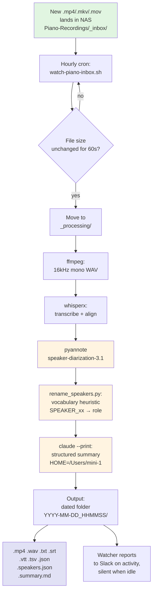

# How I built a self-running pipeline for our piano lessons

*From a Microsoft Teams recording to a dated folder of transcripts, subtitles, and summaries — with no manual steps after the file lands.*

Every week, the boys in our house take piano lessons over Microsoft Teams. Every week, I want a permanent searchable record of what was taught. The free tier of Teams doesn't record, and the paid tier is a few dollars a month I didn't want to add to the household budget. So I started recording the screen with OBS. That was the workaround. Then I started keeping the files. Then I started running them through a transcription pipeline. Then I started diarizing them so the transcript knew who was speaking. Then I started generating a structured summary at the top of each one. The pipeline that resulted is self-running: I drop a new recording into a watched folder, the next hour the pipeline processes it, and a few hours later I have a transcript, subtitles, a speaker map, and a lesson summary, all in a dated subfolder, all searchable.

This post is about how I built it, what the pieces are, and what it has already surfaced from the lessons I record.

## Architecture

The full production flow:



Six stages. The orchestrator script chains them. The watcher at the front is the only thing continuously running; the rest fire only when there's a new file.

## Stage 1: ffmpeg — extract audio

The recordings are screen captures of Teams calls: `.mp4` or `.mkv` files with both audio and video. WhisperX wants audio. The first stage extracts a 16 kHz mono WAV:

```bash
ffmpeg -i "$INPUT" \
  -ac 1 -ar 16000 \
  -c:a pcm_s16le \
  "$WORKDIR/${BASENAME}.wav"
```

Why 16 kHz mono: WhisperX's required input format. Why we keep the WAV after the run: re-runs are much faster when audio extraction is already done, and re-running happens often during prompt tuning.

## Stage 2: whisperx — transcribe and align

WhisperX is Whisper with forced alignment. The `small` model handles initial transcription. A separate alignment pass fixes word-level timestamps. The output is word-level segments with start and end times, which the next stage needs.

```bash
whisperx "$WORKDIR/${BASENAME}.wav" \
  --model small \
  --language en \
  --output_dir "$WORKDIR" \
  --initial_prompt "$INITIAL_PROMPT" \
  --compute_type int8 \
  --batch_size 8
```

Two knobs worth flagging:

- **`--compute_type int8`** is the right choice on Apple Silicon CPU. `float16` is rejected on CPU. `int8` runs at about 5x real-time on the M-series chip this pipeline runs on.
- **`--initial_prompt`** is the single biggest accuracy lever after model size. The default prompt is short and vocabulary-only: a list of piano terms (`scale`, `chord`, `treble clef`, `bass clef`, `sharp`, `flat`, `natural`, `slur`, `tie`, `measure`, `harmonic interval`, `melodic interval`, `whole note`, `half note`, `quarter note`, `eighth note`, `middle C`, `finger one` through `finger five`, `left hand`, `right hand`, `forte`, `piano`, `mezzo`, `crescendo`, `staccato`, `legato`). Long sentence-form prompts leak into transcripts — Whisper echoes them as if they were spoken, especially on low-confidence segments. Keep the prompt a vocabulary list. Override per-run when a specific piece is being practiced.

## Stage 3: pyannote — speaker diarization

Transcription without speaker labels is mostly useless. A transcript that says "good job" with no idea who said it is a dead end. Diarization is the step that figures out who said what.

The pipeline uses `pyannote/speaker-diarization-3.1` from HuggingFace. The model clusters audio segments by voice, and the output is segments tagged with `SPEAKER_00`, `SPEAKER_01`, etc. The model downloads on first run (~50 MB) and is cached. It requires a HuggingFace token and explicit acceptance of the pyannote license.

```python
pipeline({
    "audio": wav_path,
    "min_speakers": 2,
    "max_speakers": 3,
})
```

`min_speakers=2 max_speakers=3` is the right setting for a 1-on-1 lesson with occasional drop-in from a parent. Auto-detect (no constraint) over-segments the teacher's voice into 4+ clusters because the model treats slight pitch variations as different speakers. The constraint forces clean turn-by-turn labels. It is a hint, not a hard cap — pyannote can still emit a `SPEAKER_UNKNOWN` bucket for unassigned segments when the actual count exceeds the cap. The rename step handles those.

## Stage 4: rename_speakers.py — vocabulary heuristic

Raw diarization output is `SPEAKER_00`, `SPEAKER_01`. The pipeline needs role labels: `Teacher`, `Parent`, `Student`. The rename step walks each speaker's text and scores the speaker against a small vocabulary table:

```python
TEACHER_TELLS = [
    "good job", "let's try", "play it again", "one more time",
    "slower", "faster", "louder", "softer", "count out loud",
    "look at the page", "next piece", "let's start with",
]

PARENT_TELLS = [
    "say thank you", "sit up", "are you listening",
    "say hi", "wave", "be nice", "share",
]

def classify(text, scores):
    text_lower = text.lower()
    for phrase in TEACHER_TELLS:
        if phrase in text_lower:
            scores["teacher"] += 1
    for phrase in PARENT_TELLS:
        if phrase in text_lower:
            scores["parent"] += 1
    return scores
```

The speaker with the highest teacher score is labeled `Teacher`. If multiple speakers tie, the tiebreaker is total speech time. Speakers that score below a threshold default to `Student`. The mapping and the raw scores are written to a `.speakers.json` file next to the transcript, so the labels can be reviewed and the heuristic retuned without re-running diarization.

It is not perfect. About 10% of segments end up with the wrong label, usually on the boundary between "instructional encouragement" (teacher) and "encouragement" (parent). The summary step is forgiving about this. The human reader is forgiving about this. The search index is forgiving about this.

## Stage 5: Claude summary

The transcript is 30-50 minutes of dense audio. The summary is a short Markdown file with five sections: Topics, Pieces, Books/Pages, Issues, Homework. It tells a reader what the lesson covered, what book pages were worked from, what was flagged as a problem, and what to practice before the next class.

The summarizer calls `claude --print` with a structured system prompt. The transcript goes in as the user message. The output goes to `<stem>.summary.md`.

```bash
HOME=/Users/mini-1 claude --print \
  --system-prompt-file "$PROMPT_PATH" \
  < "$TRANSCRIPT_PATH" \
  > "$SUMMARY_PATH"
```

The `HOME=/Users/mini-1` override is required. The `claude` CLI reads its OAuth credentials from the real user home, and the agent that runs the script has a sandboxed home. Without the override, the call fails with an auth error. The orchestrator sets this explicitly.

## Stage 6: the watcher cron

The watcher is a small bash script that runs once an hour. It checks the inbox, waits 60 seconds to confirm the file is no longer being written, then moves it to `_processing/`, runs the pipeline, and parks the output in a dated folder. If the inbox is empty, the script stays silent — no Slack noise.

```
Piano-Recordings/
├── _inbox/        # drop new .mp4/.mkv/.mov here
├── _processing/   # watcher moves file here while pipeline runs
├── _failed/       # watcher moves file here on pipeline error (with .error.log)
└── YYYY-MM-DD_HHMMSS/   # completed lessons
```

The watcher is a real cron job, not a long-running daemon. Empty stdout means silent — the hourly tick is designed to produce no Slack output unless there's actual work. On activity, the watcher emits a structured summary: how many files processed, how many failed, first 10 lines of each new lesson summary.

A stability check is the most important detail. macOS file copy is not atomic — a file can appear in the inbox before the bytes are flushed. The watcher waits 60 seconds of unchanged file size before processing. Skipping this step causes intermittent "file not fully written" errors on slow connections.

A stale rescue handles the failure case: any file stuck in `_processing/` for more than 2 hours gets moved to `_failed/` with an `.error.log` sidecar. Without it, a transient pipeline failure leaves a file in limbo forever.

## Output layout

Each completed lesson gets its own dated folder:

```
Piano-Recordings/2026-05-30_163000/
├── Video-20260530_163000-Meeting Recording.mp4
├── Video-20260530_163000-Meeting Recording.wav
├── Video-20260530_163000-Meeting Recording.txt
├── Video-20260530_163000-Meeting Recording.srt
├── Video-20260530_163000-Meeting Recording.vtt
├── Video-20260530_163000-Meeting Recording.tsv
├── Video-20260530_163000-Meeting Recording.json
├── Video-20260530_163000-Meeting Recording.speakers.json
└── Video-20260530_163000-Meeting Recording.summary.md
```

The `.txt` is the speaker-labeled transcript. The `.srt` and `.vtt` are the same content as subtitles. The `.tsv` is the machine-readable word-level output. The `.json` is WhisperX's full output including word-level timestamps. The `.speakers.json` is the diarization debug file (mapping, scores, threshold). The `.summary.md` is the human-readable summary. The `.wav` is kept for fast re-runs.

## Performance

On Apple Silicon, the `small` Whisper model:

- Transcription alone: ~5x real-time (7.6 minutes of audio → ~1.5 minutes of compute)
- With diarization added: ~1x real-time (the pyannote model and the alignment pass roughly double the time)
- A 30-minute lesson completes in about 30 minutes of wall clock on the M-series chip
- A `medium` model is 2-3x slower; I haven't needed it

## Pitfalls (the things that broke and how I fixed them)

**whisperx 3.7.5 hard-pins torch ~=2.8.0.** I couldn't downgrade torch to bypass a `weights_only` issue introduced in PyTorch 2.6+. PyTorch 2.6+ defaults to `weights_only=True` for `torch.load`, which rejects the `omegaconf` classes in pyannote's model files. The fix is a small Python wrapper that monkey-patches `torch.load(weights_only=False)` unconditionally — `lightning_fabric` passes `weights_only=True` explicitly, so a conditional patch doesn't help. The wrapper is `whisperx_safe.py`. The pipeline invokes whisperx through this wrapper, never through the bare `whisperx` CLI.

**Long initial prompts leak into transcripts.** A prompt containing book titles and series names appeared verbatim as a transcript line for a low-confidence audio segment. Whisper echoed the prompt as if it were spoken. The fix is a strict rule: the prompt is a vocabulary list, not a sentence. Per-run override is allowed for specific piece titles, kept short.

**Auto-detect over-segments the teacher's voice.** Without `min_speakers=2 max_speakers=3`, pyannote splits the teacher's voice into 4+ clusters based on slight pitch variations. The constraint forces a clean turn-by-turn label set.

**`~` in agent context expands to a sandbox home.** The orchestrator script always uses absolute paths to files on the NAS and to the workspace. Shell `~` in this context points to the agent sandbox home, not the real user home, and the NAS is mounted under `/private/tmp/nas_movies`, not under a `/Volumes/` path.

**The NAS mount is at `/private/tmp/nas_movies`, not `/Volumes/video`.** macOS's auto-mount puts SMB shares under `/Volumes/`, but the SMB share on this NAS is mounted at the temporary path for a reason I no longer remember. The script uses the absolute path everywhere; nothing in the pipeline assumes `/Volumes/`.

## What the system has already surfaced

I have ~17 hours of audio in the archive now. Reading back through the summaries, the transcripts surface things the videos alone never would have. A few worth flagging:

**The offhand mention.** The teacher once told one of the students, mid-lesson, that her husband was home recovering from open-heart surgery. She said it in passing, the way an adult tells a child something they think a child can hold. He didn't say anything back. They went back to the piece. I was in the room when it happened. I had forgotten it. The transcript remembered. That is what diarization and a dated transcript are for — they are the only reason I know the moment happened at all.

**The 38-minute lesson.** The younger boy had a lesson that ran almost 40 minutes — twice the normal length — because he got frustrated with a piece and refused to play. The teacher didn't push. She sat with him. She let him try, let him fail, let him try again. The summary captured, in its own words, that the student experienced frustration, the teacher used patience, and the piece was eventually completed. That is what happened. The transcript is the only reason I know the texture of how that lesson actually went.

**The older boy coaching the younger one.** The older boy has been playing longer. In one of the younger boy's lessons, after the teacher explained the sharp-within-measure rule, the older boy was at the piano before the next call and walked the younger one through it himself. The summary noted that the older sibling provided peer instruction during an inter-lesson period and demonstrated an internalized grasp of the rule. I would not have written that sentence in a thousand years. The model surfaced it because diarization caught a third voice during what was supposed to be a one-on-one lesson. I had no idea it was happening. The model did.

**"Rockin' Rabbits."** One of the first pieces in the book is called "Rockin' Rabbits." The model — at least in early runs — kept hearing it as "Rockin' Rabies." A five-year-old saying the word "rabbits" produces audio the model is not confident about, and its first guess was a different small animal entirely. I have at least four transcripts in a row that all say "Rockin' Rabies." It became a family joke. The model got it wrong consistently enough that the wrongness became a record in its own right — a small data point on what a five-year-old's voice sounds like to a model trained mostly on adult speech.

## What the transcripts make possible that the videos don't

The pipeline was supposed to be an archive. It became a study tool. The reason is that text is searchable, indexable, and reviewable in a way video isn't. A few of the things the transcripts let us do that the videos alone never could:

**Vocabulary growth across time.** A simple `grep "staccato" *.txt` across all 17 weeks of lessons returns every mention, in order, with the date. You can see when the teacher first introduced the term (lesson 4), how many times she repeated it across the first month, when one of the boys started using it correctly, and when she stopped having to explain it. The vocabulary of piano has a curriculum — techniques like staccato, legato, curved fingers; rhythms like eighth-note pairs, syncopation, dotted-quarter + eighth; tempo terms like andante, allegro. The transcripts are the curriculum rendered in a searchable form. As a parent, I can see which concepts are landing and which the teacher has to keep re-teaching. The list is the teaching plan. The transcripts are its audit log.

**The "Issues" list is a weekly diagnosis.** Every summary has a section called "Issues" — what the teacher flagged as problems that week. Reading 17 weeks of Issues in chronological order is like reading a doctor's chart: "curved fingers, slowing down on the upbeat, missing the repeat sign." Each issue is a target. At practice time, we know which of the boys' instincts the teacher is still correcting, and we listen for them. The video doesn't give you that. The video gives you 30 minutes of footage and the lesson is over.

**Piece progression, measured.** You can see when a piece was introduced (the teacher says "let's start with X"), when it was reviewed ("let's play X again this week"), and when it was retired ("you know this one now"). Across 17 weeks the boys worked through 11 pieces, and the transcripts are the only record of how long each one took to land. "Hot Cross Buns" took two weeks. "Alpine Song" took six. The data is in the text. The videos would require a manual review we never would have done.

**Look-back without rewinding.** When the teacher says, mid-lesson, "remember what I told you about X last week," the transcripts let you look up last week's lesson and find X. With a video, you'd have to scrub through 30 minutes of footage and hope you remembered the timestamp. With a transcript, it's a 5-second search. This changed practice at home. We started being able to answer our own questions about what the teacher had said, instead of waiting until the next lesson to ask.

**The 1% better pattern.** Reading the summaries in order, a quiet pattern emerges: each boy gets 1% better at one thing every week. The first month is mostly counting out loud. The second month is mostly fingering. The third month is mostly dynamics. The summaries surface the change without me having to find it. The model is the one doing the diff. Reading 17 weeks of "what changed this week" answers the question I would have asked, if I'd thought to ask it: how do you get better at piano? Slowly, one thing at a time, with a teacher who notices.

The pipeline was supposed to be a record. The pipeline is now a teacher aid, a study tool, and a parent cheat sheet. None of that was the original plan. All of it was enabled by the fact that the lessons became text.

## What the model still gets wrong

The archive is not the lessons. It is an approximation of the lessons. The model still mishears proper names on the first run about a third of the time. When two students play the same phrase in unison, diarization merges their voices and assigns the line to one speaker. The summaries smooth over small moments — a teacher telling a boy to sit up, a parent gently correcting which boy actually needed to sit up — because the model averages across many small choices, and the right one is in the average, but not the one it picks.

I have to keep remembering that. The temptation to treat the transcript as authoritative is the new version of believing the camera saw the truth. The camera didn't see the truth. The transcript isn't the lesson. Both are flattened versions of something that happened between a few people in a room with a piano. The archive is a record that the lesson happened. It is not a record of what the lesson was.

But a record that the lesson happened is enough. It is more than I had before. It is more than the average family has when their boys are grown.

## What's next

The current pipeline is enough. It runs itself, the lessons are searchable in a way the videos alone never were, and the archive is a permanent record. The next moves are nice-to-haves:

- **Voice fingerprinting.** Replace the vocabulary heuristic with voiceprint ID. Once the teacher, parent, and each student have a stable voiceprint, diarization labels speakers directly without scoring their text. This would clean up the 10% mislabel rate.
- **Cross-lesson search.** The transcripts are `.txt` files. A simple ripgrep across all dated folders answers questions like "when did harmonic intervals come up." A proper search index (SQLite FTS or Meilisearch) would make this faster and more flexible.
- **Per-lesson practice notes.** A second pass that produces a short note aimed at the student, summarizing what was learned and what to work on, in language a boy can read.

The pipeline is the goal. Everything after that is polish.
